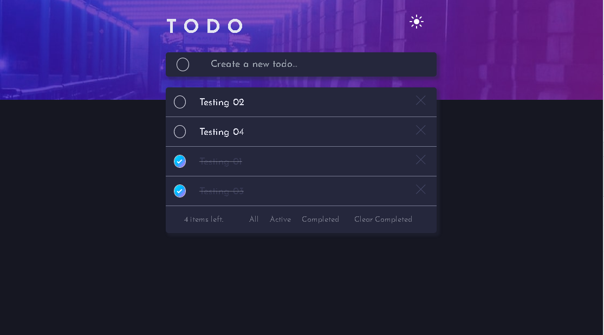
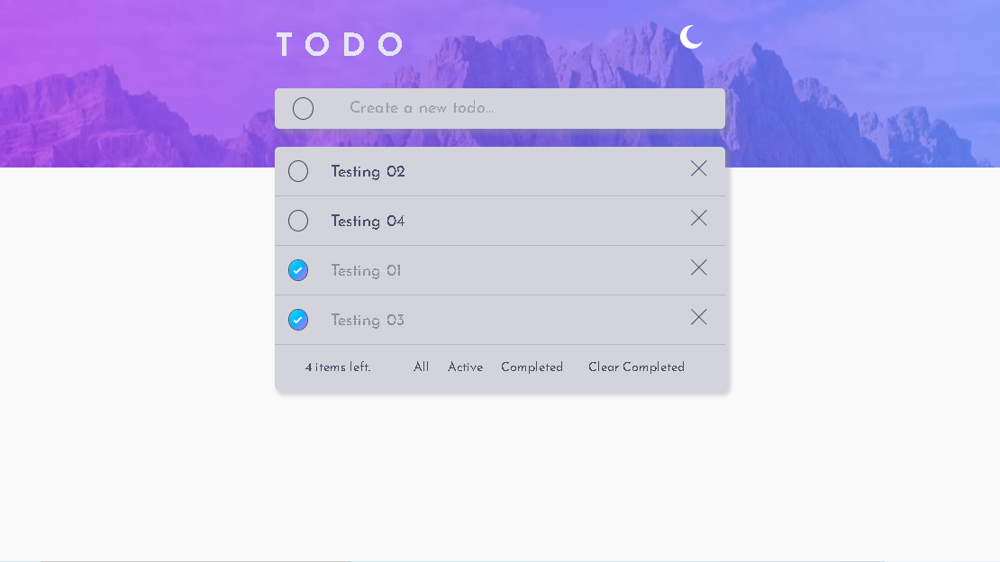
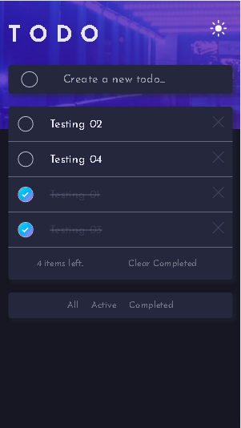
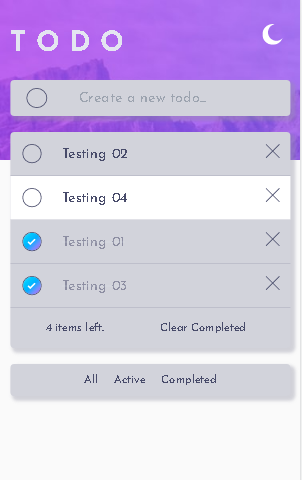

# Frontend Mentor - TO DO App.

### The challenge

Users should be able to:

- View the optimal layout for the app depending on their device's screen size.
- See hover states for all interactive elements on the page.
- Generate an application of a TO DO list, being able to generate a list of tasks that you have to perform, given that it would not contain sensitive information, it is stored in the Local Storage to be able to access it when necessary.
- Being able to switch between the three themes that the application provides, which are Dark and Light.

### Screenshot
## Desktop view:

-Dark Theme:

-Light Theme:

## Mobile view:

-Dark Theme:

-Light Theme:

### Links

- Solution URL: (https://github.com/nestordqa/todoapp)
- Live Site URL: ()

### Built with

- [Next.js](https://nextjs.org/) - React framework
- [React](https://reactjs.org/) - JS library
- Typescript.
- useLocalStorage HOOK.
- Tailwind CSS
- CSS Modules

### Continued development

I will keep developing on NextJS, Tailwind and Typescript. I think, they are greatest tools than a fullstack developer can use today.

### Useful resources

- [Tailwind Docs](https://tailwindcss.com/docs/) - This helped me for all styles, awesome tool.
- [NextJS Docs](https://nextjs.org/docs/deployment) - This is an amazing article which helped me finally understand workflow of NextJS with typescript.

## Author

- Website - [Nestor Quiñones](https://github.com/nestordqa)
- Frontend Mentor - [@nestordqa](https://www.frontendmentor.io/profile/nestordqa)
- Instagram - [@ynestordqa]()
